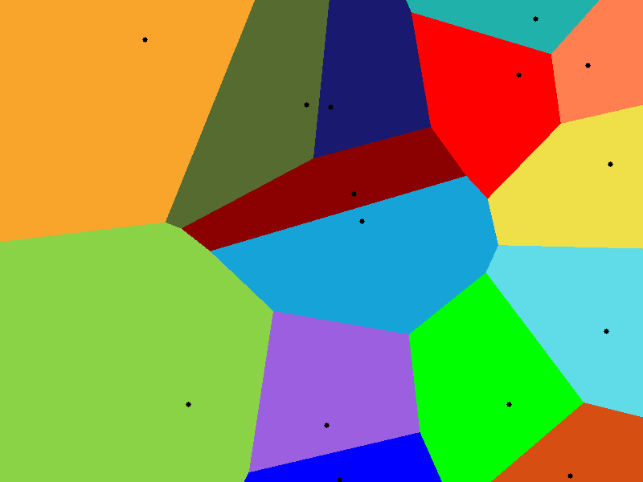

# VoronoiDiagram

- `src/voronoi_ppm.c` : The simple C program that will create a Voronoi Diagram image in PPM.

- `src/main.c` : The C program that will create a Voronoi Diagram animation/simulation in OpenGL.
    -- The program can also be run with the `--bubbles` flag to create a bubble animation/simulation.

## Example with 10 Seeds

