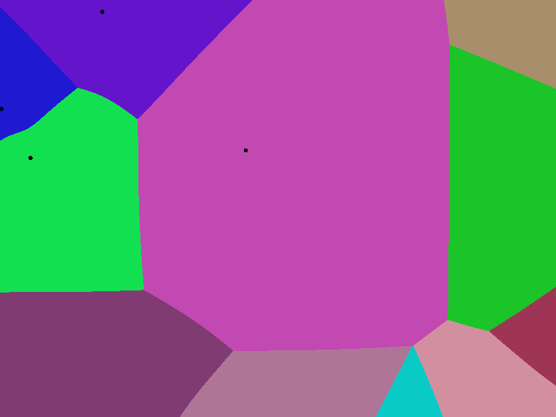

# VoronoiDiagram

- `src/voronoi_ppm.c` : The simple C program that will create a Voronoi Diagram image in PPM. Just a starting point.

- `src/main.c` : The C program that will create a 2d Voronoi Diagram simulation with collision in OpenGL.
  - The program can also be run with the `--bubbles` flag to create a bubble animation/simulation.

To compile the program, run `make` in the directory.

## Voronoi Sim Example with 20 Seeds

